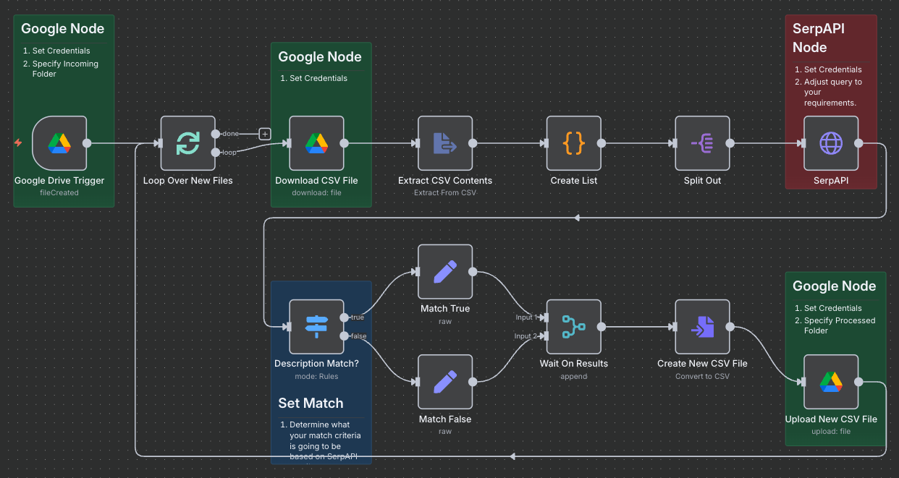

# Capture Customer Feedback

An n8n workflow to capture Customer feedback.

## Getting Started

### About This Code

A Proof-of-Concept n8n workflow created for Upwork Job ID 1945174639679424085  You're welcome to use it however you'd like.

### Requirements

* An [n8n.io](n8n.io) account (or self-hosted)
* A Google account (for Google Drive)
* A SerpAPI account (for Google searches)

### Instructions For Use

* Download csv_validation_automation.json and import it into your n8n workspace.
* Follow the instructions in the Sticky notes.  You will need to set your Google credentials on all Google nodes and your SerpAPI credentials on the SerpAPI node.

### Optional
* Set the SerpAPI query to meet your specifications.
* Update the description matching to meet your specifications.

## Authors
* **Aaron Melton** - *Author* - Aaron Melton <aaron@ascendautomation.ai>
